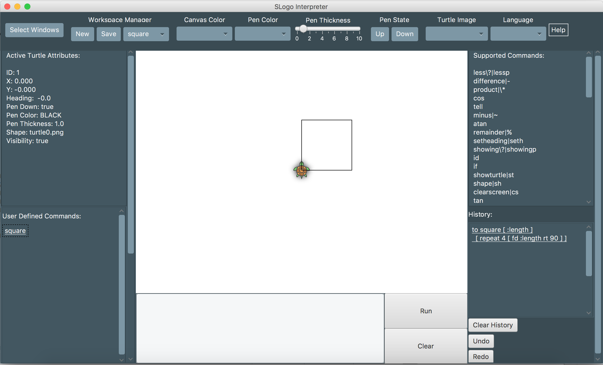

# slogo

A development environment that helps users write SLogo programs.

*  Front-End: David Tran, Ryan Chung
*  Back-End: Aaron Paskin, Ian Eldridge-Allegra

10/10 to 10/30

Interface:

Resources cited in line where applicable. 

To run: Main.java

Several resource files are required: 
* language properties files
* SyntaxErrors.properties
* choicebox.properties
* view.css
* view.properties
* completeCommands.properties
* data files of saved variables, including KnownFiles.properties

Included:
* All basic commands
* All extended commands
* Grouping
* Recursion

Some basic design decisions:
* unlimited arguments for differences and quotients are handled as the first argument minus/divided by all others.
* Tell, ask, askwith will throw an exception when nested inside turtle commands -- you can't ask each turtle to tell other turtles something. 
* Writing 

