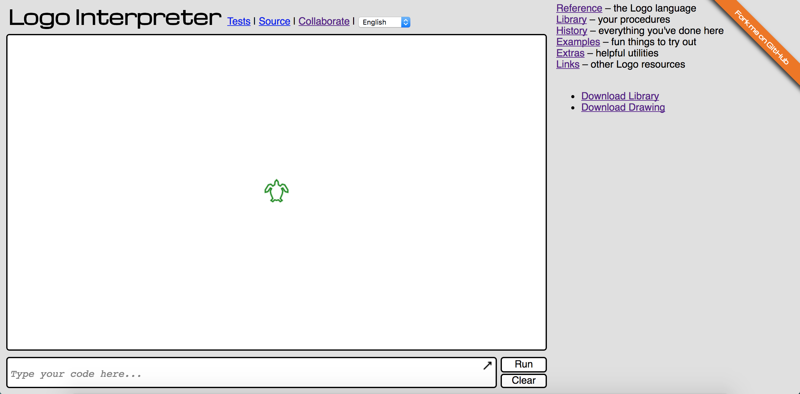

# SLogo Team 8

## Project Members
 * Aaron Paskin
 * Ian Eldridge-Allegra
 * David Tran
 * Ryan Chung

## Introduction

This project’s aim is to provide a user-friendly programming environment for a simplified version of Logo. The program is divided into two major parts -- the Model, and the View -- which are connected via a Controller. The model holds the data regarding the state of the turtle, the variables, and any user-created commands. It is capable of executing code and updating these states. As these states change, the model makes the changes available to the view through listeners. Since Model and View contain no direct references to one another, one could be extended or replaced without altering the other. The model will be written to accommodate for  new commands without being edited using resource files. The view would have to be changed to use different classes for Panes if needed, but the bulk of changes would be in new classes. 


## Design Overview


The Model can be accessed through the Model class, and the data inside is primarily accessed via three listeners -- the TurtleListener, which can monitor changes to the Turtle’s state; the CommandListener, which receives Strings representing new commands being added to the program; and the VariableListener, which receives an updated map of variable names to values when there is a change to any variable. Within the model, Commands are used to represent individual, executable lines of SLogo code. Subclasses of Command describe specific commands (fd, rt, etc). The Turtle object represents the state of the turtle, and notifies its listeners when changes are made to its state.

The View can be accessed through the View class, which essentially organizes the Panes in the window. The TextPrompt contains a text field for users to enter code. The TurtleView shows the turtle with any lines it has drawn, and is a TurtleListener so it can get updates directly from the Turtle. The ReferenceDisplay contains a default description of basic SLogo usage. HistoryDisplay contains all previously run code. VariableDisplay shows the variables currently available to the user and their values, and is updated by the Model as a VariableListener. The UserDefinedCommandDisplay shows the currently available user-defined commands, and is updated by Model as a StringListener. 

The Driver connects the two halves of the program. When run, it starts the program. It distributes the listeners from View to Model, and gives the View access to Model’s execute method via a lambda expression.


## User Interface

The user interface will consist of one window. The window will mainly be divided into two parts: commands and turtle view. In commands, the user will be able to type in commands and also have access to different information such as command history, commands in different languages, etc. Commands will also have buttons such as ‘run command’ and ‘clear command’ so users can easily run/edit inputs. In turtle view, the user will be able to see the changes resulting from the commands. It will also have a button that allows user to change the color of the background. In any erroneous situation caused by bad user input, a message will appear notifying the user to use correct commands, and the bad input will be disregarded. 

Screenshot below is an example of what our window might look like. 




## API Details 

The external API for the model includes the Model class and the ImmutableTurtle interface. Model is given codes entered by the user through the view, which are parsed and executed on the turtle by the model’s internal API. The ImmutableTurtle interface passes the updated status values of the turtle to the view so that the display of the turtle may be updated accordingly.

The internal API for the model includes the Turtle class and the Command interface. The Turtle class provides an object for the model to update as it executes commands. Within the setters of Turtle, TurtleListener’s change methods are also called so that the respective turtle in the view may be updated accordingly. Classes that implement Command have an execute method that updates a Turtle parameter or modifies a Collection of commands or variables. These parameters are passed into Command from Model so that these data structures are updated upon the execution of commands. In order to add a new command to the SLogo language, a programmer should add a new class that implements the Command interface and define the execute method so that in enacts the desired changes on the desired data structures. Similar to TurtleListener, StringListener and CommandListener allow the View to see the changes to Model’s command and variable Collections enacted by Command’s execute method.

The external API for the view includes the View class and the TurtleListener, StringListener, and VariableListener interfaces. The View uses a Consumer of Strings to use Command’s execute method whenever a command is entered by the user. View also uses the listener interfaces to detect changes to the data structure in Model that need to be updated in the display, including the turtle image, the list of commands, and the list of variables and their values.

The internal API for the view includes several classes that represent the windows and sections of windows that are displayed on the screen. They all extend Pane and implement the appropriate listener to detect changes in the model. Adding a new window or part of the user interface requires a programmer to create a new class that extends Pane. If the new window or UI component needs to be updated with changes to parts of the model, a new listener interface should be created to detect the changes to those parts of the model and enact those changes on the window or UI component.


## API Example Code

### FD 50

When fd 50 is typed and the run button is pressed, the TextPrompt calls:

```java
consumer.accept(string);
```

where string = “fd 50”. Consumer is a lambda expression that was passed to the View from Driver, which calls:

```java
model.execute(string, view.getLanguage());
```

The model’s execute method parses the string into commands one at a time, and calls:

```java
command.execute(turtle, commands, variables);
```

‘commands’ and ‘variables’ are both unmodified by fd, but the command (fd) updates turtle’s position using setXY (and the get methods to determine the direction and original position). When it does so, the turtle calls the TurtleListener’s locationChange method, but since in practice the TurtleListener is actually an instance of TurtleView, the TurtleView will be the object notified. It can then use the change in position, along with the current position given by the ImmutableTurtle, to draw a line on the screen and move the turtle image to its new position. The View can add the string passed to execute to the history using the updateHistory(string) method.

### Team Member Specific Use Cases

#### Aaron

1. ‘Execute’ method in Model class receives String “rt 50”
	- Method calls on Parser methods to parse “rt 50”.
	- Parser tells ‘execute’ to create a new RT Command.
	- RT executes, calling Turtle’s ‘setHeading’ method and passing in 50 so that the heading instance variable increases by 50.
	- ‘setHeading’ also notifies the TurtleListener that a change to the angle of the turtle has been made.

2. ‘Execute’ method in Model class receives String “TO go fd 50 END go”
	- Method calls on Parser methods to parse “TO go fd 50 END go”.
	- Parser tells ‘execute’ to create a new class go that implements the Command interface and passes into the new class the String that follows before END.
	- Method tells VariableListener to check for new variables and send the changes to objects in View.
	- Parser tells ‘execute’ to create a new instance of go.
	- Go executes, calling the Turtle’s ‘setXY’ method to move it forward 50.

#### Ian

1. Parse String “rt sum 10 20”
	- Use list of known commands to see “rt” takes one argument
	- Get the argument from “sum 10 20”
		* See sum takes two arguments
		* Get argument from “10 20”
			1. Identify 10 as a number. Wrap it with a class implementing command and return it.
		* Get argument from “20”
			1. Identify 20 as a number. Wrap it with a class implementing command and return it.
		* Return the Sum object.
	- Return RT object, which holds a Sum object, which holds two NumberCommand objects.

2. Parse String “repeat 10 [ fd 20 ]
	- Use list of known commands to see repeat takes an argument and a list
	- Get the argument from “10 [ fd 20 ]”
		* Identify 10 as a number. Wrap it with a class implementing command and return it.
	- Get the list from “[ fd 20 ]”
		* Parse “fd 20” into a list of commands
			1. Use list of known commands to see fd takes one argument  
			2. Get the argument and add it to a list
				- Identify 20 as a number. Wrap it with a class implementing command and return it.
		* Return list containing a FD command
	- Return a Repeat object containing a NumberCommand and a List<Command>.


#### Ryan

1. Store Command “fd sum sum sum sum 10 20 30 5 5” to Command History
	* When “fd sum sum sum sum 10 20 30 5 5” command is typed and run button is pressed, TextPrompt calls consumer.accept(string).
	* View can call updateHistory(string).
	* updateHistory(string) method will take the string, add it to list. List will be displayed through HistoryDisplay

2. Run command “fd sum sum sum sum 10 20 30 5 5” when ‘run’ button pressed
	* Button implemented as private class in pane
	* eventHandler -> when button is clicked, TextPrompt call consumer.accept(string). 

#### David

1. User selects a new pen color from drop-down list.
	* Pallete class extending Pane has ColorListener that detects new pen color selection from the drop-down list (ChoiceBox object).
	* ColorListener will call penChange() from TurtleListener interface that changes the pen color of the turtle.

2. Update turtle view when turtle heading is changed
	* Model executes a command that changes the turtle angle (i.e. ‘heading’ attribute of turtle is modified)
	* ‘setHeading’ notifies the TurtleListener that a change to the angle of the turtle has been made.
	* TurtleView extending TurtleListener calls headingChange(double dtheta).
	* TurtleView calls TurtleImage.setRotate(Turtle.getRotate() + dtheta)


## Design Considerations 

A design decision we discussed was how to pass the backend turtle’s information to the view. We debated whether we should declare a Turtle in view that matches the backend turtle, or rather pass the data individually to view. We decided to use a TurtleListener interface that is implemented by objects in view and detects changes in the backend Turtle without passing the Turtle itself to the view. This allows the program to only extract the most important data from the backend when displaying the turtle: the statuses that changed on a given code execution.

One decision that still has to be resolved is how known commands will be represented, and what data structure will hold them. Typically this type of decision would be an implementation detail, but since the structure has to be shared between Model and Commands, we will have to resolve that before Command and Model can work together. The best way to implement this will become more clear when the parser is being written.


## Team Responsibilities

* Ian Eldridge-Allegra -- Parser (a private class in Model) and Commands
* Aaron Paskin -- Model (class), Turtle, ImmutableTurtle
* Ryan Chung -- HistoryDisplay, TurtleView, Buttons, Language
* David Tran -- ColorPallete, TextPrompt, VariableDisplay, TurtleView


